{width=0.7in height=0.7in}

**Pansen Engineering × VMS**

**Visitor Management System — Administrator SOP**

A quick, visual guide. Each red number on a screenshot matches a numbered step below it.

Version 2.3 · 2026-08-11 · Pansen Engineering India Pvt. Ltd.

| Field | Value |
|---|---|
| **Document** | VMS Administrator SOP |
| **Version** | 2.3 (supersedes all earlier copies) |
| **Date** | 2026-08-11 |
| **Owner** | IT / Operations |
| **Audience** | VMS administrators, site managers, security |
| **Standards** | ISO/IEC 82079-1 · ISO/IEC 27001 access control |
| **DPDP Act 2023** | Alignment **in progress** — the consent notice and data-retention controls are not yet live on this site. Do not treat this document as evidence of DPDP compliance. |
| **Site** | pansen.vmsys.co |

\newpage

# How to read this guide

Every task follows the **same three-part pattern**, so you always know where to look:

| Part | What it is |
|---|---|
| **① ② ③ on the picture** | Red circles on the screenshot mark exactly where to click |
| **The step table** | The same ① ② ③ numbers, telling you what each one does |
| **The blue note** | One tip or warning worth knowing |

> **Golden rule.** Red circle ① on the picture = step ① in the table. Always match the numbers.

\newpage

# The journey at a glance

The system carries two kinds of people and they behave differently. Read this
page before anything else — most mistakes come from treating a worker as a
visitor.

```
   VISITOR or WORKER          GUARD                     ADMIN
   ─────────────────          ─────                     ─────
   Register on phone   ──▶    Scan QR at gate    ──▶    Sees everything,
   (photo + OTP)              (check in / out)          runs reports
        │                          │                         │
        ▼                          ▼                         ▼
   Gets QR instantly          Full profile shows        Live on-site count
   (no approval wait)         on every scan             stays accurate
```

**Visitor or Worker — the difference that matters:**

| | Visitor | Worker |
|---|---|---|
| Who | A meeting, delivery or audit | Contractor labour, on site for days or weeks |
| Asks for | Company, host, visit date | Contractor company, work description, **start and end date** |
| Pass valid | That visit date only | Start date → **end date** |
| If the end date is left blank | — | **30 days.** See §7. |

**The pass lifecycle — five states, in order:**

| State | Meaning | Enter? |
|---|---|---|
| **Issued** | Registered; QR is live (happens automatically) | ✅ |
| **Checked In** | Scanned in at the gate | inside |
| **Checked Out** | Scanned out (or auto-closed at day end) | next day (Worker) |
| **Expired** | Past its valid-until date | ❌ |
| **Cancelled** | Withdrawn by an admin | ❌ |

\newpage

# 1 · Sign in

*Goal: get into the admin back office.*

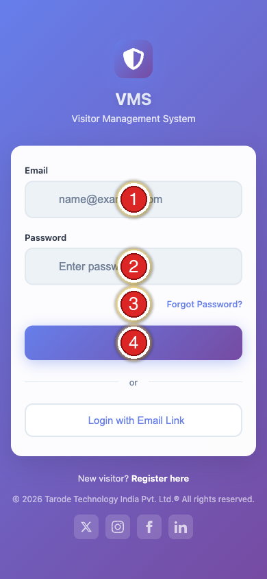{ width=2.5in }

| Step | Do this |
|:---:|---|
| **①** | Type your **email** |
| **②** | Type your **password** |
| **③** | Forgot it? Click **Forgot Password** |
| **④** | Click **Login** |

> **Note.** One login per person — never share accounts. Every action is traced to you.

\newpage

# 2 · The dashboard

*Goal: know where everything lives.*

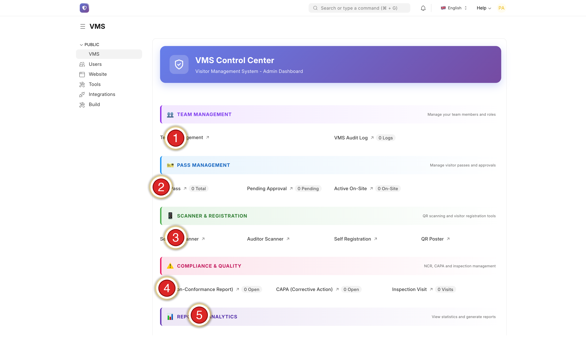{ width=6.0in }

| Step | Section | Use it for |
|:---:|---|---|
| **①** | Team Management | Add / remove staff |
| **②** | Pass Management | Create & find passes — **daily** |
| **③** | Scanner & Registration | Gate scanner + sign-up link — **daily** |
| **④** | Compliance (NCR) | Quality forms (if used) |
| **⑤** | Reports & Analytics | Stats & exports |

> **Check this first each morning:** the **On Site** number at the top — it shows who is inside right now.

\newpage

# 3 · Find a pass

*Goal: locate any pass quickly.*

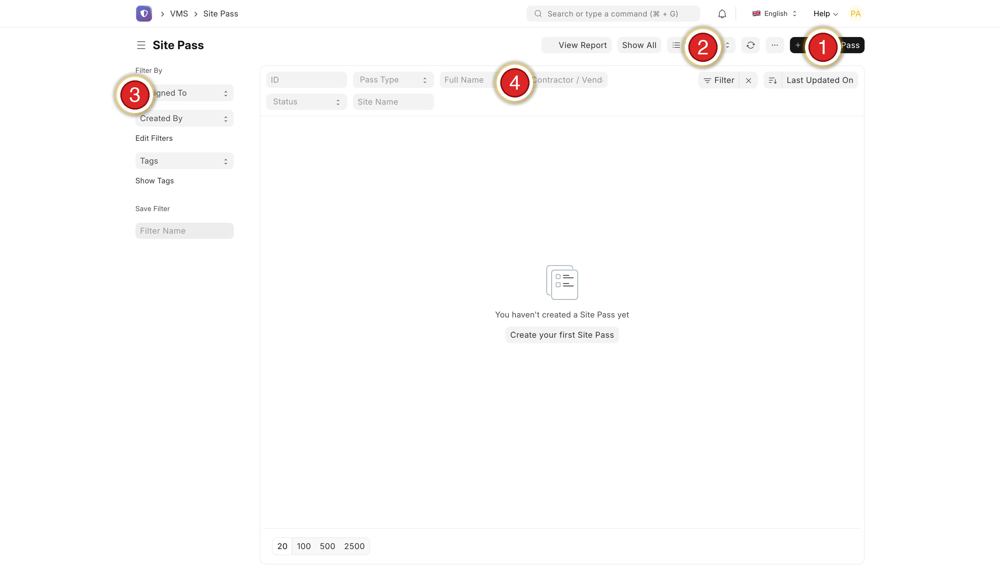{ width=6.0in }

| Step | Do this |
|:---:|---|
| **①** | **+ Add Site Pass** — create one by hand (Section 4) |
| **②** | **Batch Approve** — legacy, rarely needed |
| **③** | Left filters — Assigned To, Created By, Tags |
| **④** | Top search — ID, Type, Name, Status, Site |

> **Tip.** Click any row to open the pass. Click **View Report** (top right) for charts.

\newpage

# 4 · Create a pass manually

*Goal: make a pass for someone who can't self-register.*

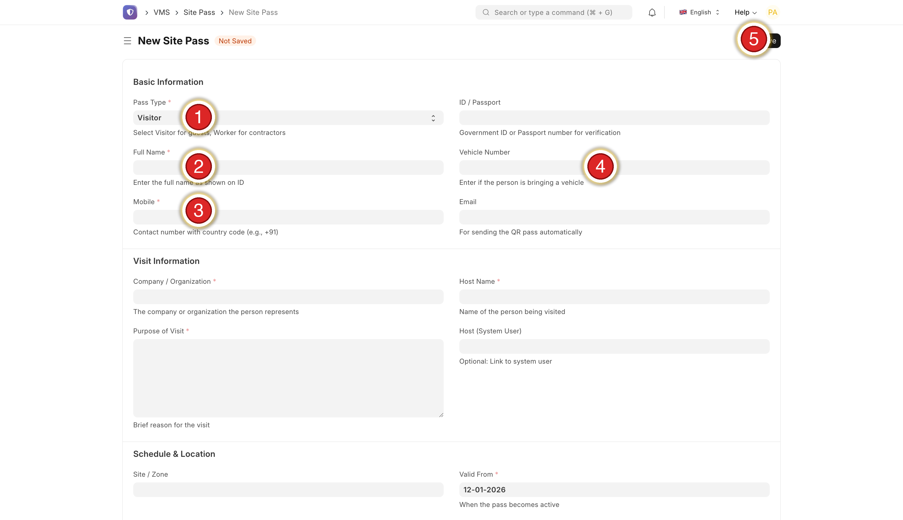{ width=6.0in }

| Step | Do this |
|:---:|---|
| **①** | **Pass Type** — Visitor / Worker / Vendor |
| **②** | **Full Name** — as printed on the ID |
| **③** | **Mobile** — with country code (+91…) |
| **④** | **Email** — for QR delivery |
| **⑤** | **Save** (top right) |

> **Important.** A **photo is required** — the pass will not save without one. Dates must be today → 90 days ahead.

\newpage

# 5 · Edit, extend or cancel

*Goal: fix or change a pass after it is issued.*

| If… | Do this |
|---|---|
| Wrong email | Fix Email → Save → **Resend QR** |
| Wrong dates | Change Valid From / Until → Save (QR still works) |
| Wrong host | Change Host Name → Save |
| Extend a worker | Change **Valid Until** (≤ 90 days) → Save |
| Visit cancelled | Click **Cancel** at the top |

> **Note.** The **mobile number can't be changed** after issue — cancel and create a new pass instead.

\newpage

# 6 · Visitor self-registration

*Goal: let visitors register themselves before they arrive.*

Share **pansen.vmsys.co/register** — print it as a gate poster, email it, or send by WhatsApp.

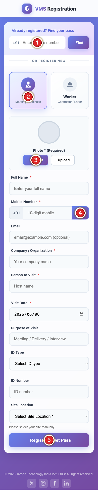{ width=2.3in }

| Step | The visitor does this on their phone |
|:---:|---|
| **①** | Returning? Type mobile + **Find** to reuse a past pass |
| **②** | Pick **Visitor** or **Worker** |
| **③** | Add a **photo** — **required** (Camera or Upload) |
| **④** | Type mobile → tap **OTP** → enter the SMS code |
| **⑤** | Fill the form → tap **Register & Get Pass** |

> **Important.** No photo = no pass. The pass is **issued instantly** after they submit — no approval step, no admin action. It appears in your list as *Issued*.

## Verify with Aadhaar + face check (recommended)

*Goal: confirm the visitor's identity from their Aadhaar — offline — and confirm the person registering is the cardholder.*

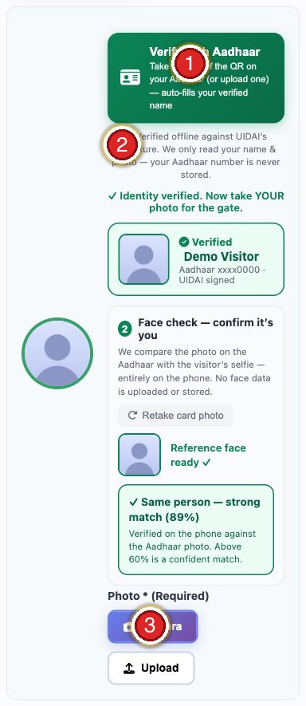{ width=3.0in }

| Step | On the registration screen |
|:---:|---|
| **①** | **Verify with Aadhaar** — tap to start |
| **②** | Privacy note — verified offline against UIDAI; the Aadhaar number is never stored |
| **③** | **Photo (Required)** — the visitor's live selfie for the gate |

**What happens, in order:**

1. **Verify the card.** Tap **Verify with Aadhaar** → **take a photo of the Secure QR** (back of the card), or tap **Upload** and pick a clear close-up. On success a green **✓ Verified** card shows the name and last 4 digits, and the **Full Name is filled and locked**.
2. **Face check.** A **Face check** panel then appears. Tap **Photograph the FRONT of the Aadhaar** (the photo side) → *Reference face ready ✓*. Then tap **Camera** below and take the visitor's **live selfie** (front camera).
3. **Result.** It shows instantly: **✓ Same person (xx%)** in green, or **✗ Faces don't match** in red.

> **Reading the score.** Two photos of the same person are rarely 100%. The threshold is **60%** — anything **above 60% is a confident match**. A no-match is **advisory** (the visitor can retake the selfie; the guard verifies in person at the gate), not a hard block. The entire face check runs **on the phone** — no face data is uploaded or stored.

| What it does | Detail |
|---|---|
| Verification | QR checked against **UIDAI's digital signature**, fully **offline** |
| Auto-fill | Fills and **locks the verified name** from the card |
| Face match | Confirms the **live selfie is the cardholder** — on-device, score shown |
| Privacy | Only the name is read; the **Aadhaar number and face data are never stored** |
| Forgery | A fake or altered QR is **rejected** ("failed UIDAI verification") |

> **Turning it on as mandatory.** By default Aadhaar verification is optional. To require it (no pass without a verified Aadhaar), your administrator enables it per site. Confirm scanning works on your gate devices first, so genuine visitors are never blocked.

\newpage

# 7 · Worker registration

*Goal: get contractor labour on site with a pass that expires when the job does.*

A **Worker** pass is not a visitor pass with a different label. It asks for
different information and it **lives far longer**, so it gets its own procedure.

## A · The worker registers themselves — use this by default

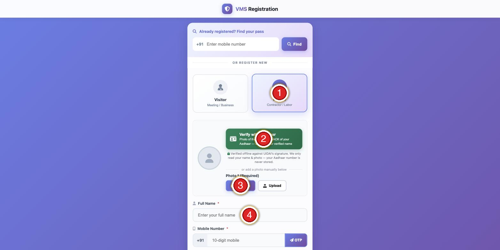{ width=4.4in }

| Step | The worker does this on their phone |
|:---:|---|
| **①** | Tap **Worker** (*Contractor / Labor*) — **not** Visitor |
| **②** | **Verify with Aadhaar** — photograph the QR on the **back** of the card |
| **③** | Add a **photo** — required. **Camera** for a live selfie, or **Upload** |
| **④** | Type the **full name** (Aadhaar fills and locks this if used) |

## B · The gate registers them — when the worker has no usable phone

Contractor labour often arrives without a smartphone, or without the reading
confidence to fill a form on one. Do not send them away. Open the same page on
a shared gate tablet, complete it with the worker standing there, and take
their photo with the tablet camera.

> **The worker's own mobile number is still required.** The OTP goes to the
> number that will be attached to the pass, and the worker must be present to
> read the code out. **Never register a whole crew against a supervisor's single
> number** — every pass then points at the wrong person, and *Find your pass*
> hands somebody else's pass to whoever types that number.

## The work details

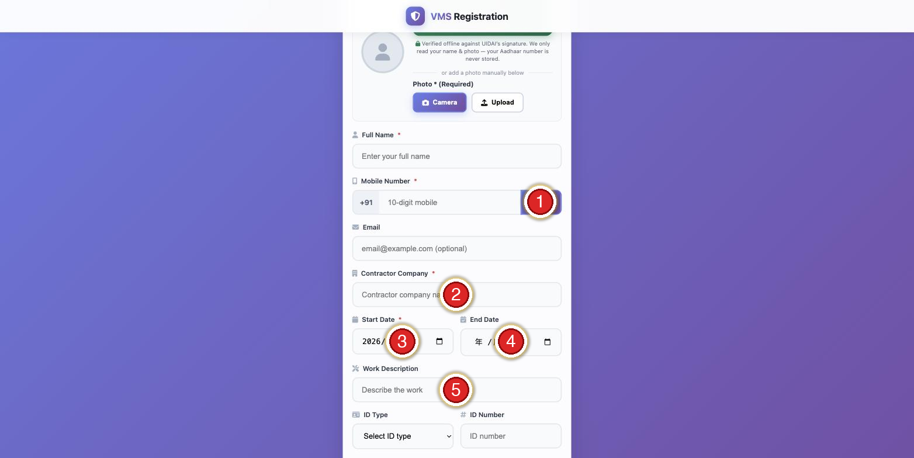{ width=4.4in }

| Step | Field |
|:---:|---|
| **①** | **Mobile + OTP** — tap **OTP**, then enter the SMS code |
| **②** | **Contractor Company** — required; the firm the worker belongs to |
| **③** | **Start Date** — required; defaults to today |
| **④** | **End Date** — *looks* optional. **Read the warning below.** |
| **⑤** | **Work Description** — what they are on site to do |

> **⚠ The End Date is the most important field on this form.**
> It carries no red asterisk, so it gets left blank — and blank does **not**
> mean "one day". A blank End Date issues a **30-day pass**. A crew registered
> for a two-day job keeps working site access for a month, and nobody is told.
> **Always set the End Date to the last day of the job.**

## After they submit

The pass is **issued instantly** — no approval step, no admin action. It appears
in your pass list as *Issued* and the worker gets a QR immediately.

| If this happens | Do this |
|---|---|
| Job finishes early | Open the pass → change **End Date** to the real last day (§5) |
| Job runs longer | Open the pass → extend **End Date** (§5). Do **not** re-register — a second pass means two QR codes for one person |
| Wrong contractor typed | Edit the pass; the contractor name is what your reports group by |
| Worker leaves the firm | **Cancel** the pass (§5). Do not just let it expire |

> **Audit your list for 30-day passes.** Filter the pass list by *Worker* and
> sort by valid-until. Anything ending exactly 30 days out was almost certainly
> a blank End Date, not a genuine month-long job.

\newpage

# 8 · The gate scanner

*Goal: check people in and out securely.*

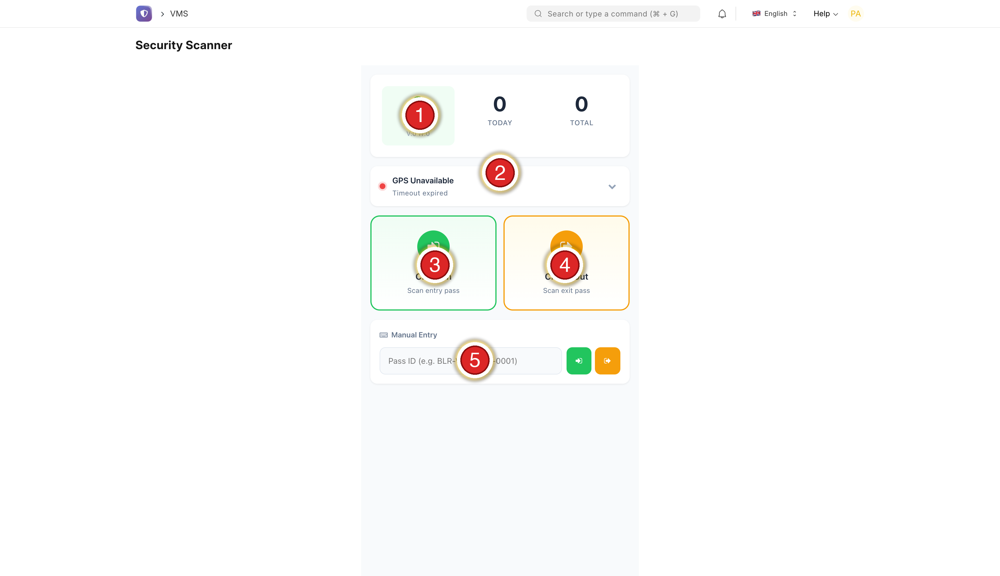{ width=4.4in }

| Step | Element |
|:---:|---|
| **①** | **ON SITE** live count (V = Visitors, W = Workers) |
| **②** | **GPS** status (green = located) |
| **③** | **Check In** (green) — scan an arrival |
| **④** | **Check Out** (orange) — scan a departure |
| **⑤** | **Manual Entry** — type a Pass ID if no camera |

**Every scan shows the full profile** — the guard sees exactly who they admit:

| On screen | Photo · Name · Worker/Visitor badge · Company · Mobile · ID number · Validity · Work/Purpose · Vehicle · **ID Verified / Not Verified** |
|---|---|

## Reading the identity checks

Recent passes also show up to two extra lines. Both are **advisory**. Neither
ever blocked a registration, and neither is a decision — they are context for
the guard looking at the person in front of them.

| Line on screen | What it means | What the guard does |
|---|---|---|
| **Face vs ID photo: Match (nn%)** | The selfie matched the Aadhaar photo | Nothing — normal |
| **Face vs ID photo: No match** | The selfie did **not** match the card | **Call the supervisor before admitting.** Do not refuse on your own |
| **Liveness: Confirmed** | A live person completed the blink / head-turn check | Nothing — normal |
| **Liveness: Not confirmed** | The check did not complete | **Ignore it.** Usually a slow phone camera, not a fraud |
| *(line missing)* | The check never ran for that pass | Nothing — older passes carry no result |

> **Never refuse entry on these two lines alone.** They are on-device
> estimates. A worker turned away because a cheap handset could not see them
> blink has lost a day's pay to a camera fault. Only a **face mismatch**
> justifies stopping to ask a supervisor.

> **What the liveness check is, and is not.** It asks for a blink and a head
> turn, which defeats somebody holding a printed photo up to the camera. It is
> **not** certified presentation-attack detection (ISO/IEC 30107-3), and it does
> **not** defeat a video replayed on a second phone, a printed mask, or a
> synthetic face. Treat it as a light deterrent. It is never proof of identity,
> and it must never be cited as an access-control measure.

## Zones

A pass can carry an **authorised zone**. If someone scans at a gate outside
their zone, the scanner shows a **zone warning**.

> **The zone warning does not block entry.** It is a prompt to ask why they are
> at this gate. Use your judgement, and escalate if the answer is unconvincing.

## When a scan will not work

| Symptom | Cause | Fix |
|---|---|---|
| Red — *Expired* | Past the valid-until date | Send to reception. For a worker this is usually a blank End Date that ran out (§7) |
| Yellow — *Already checked in* | Never scanned out | Check them out, then in. Or let auto-checkout clear it (§9) |
| *Invalid QR* | Photo of a screen, damaged print, wrong code | Use **Manual Entry** and type the Pass ID |
| Camera will not open | Browser permission | Allow camera for the site, then reload |

**Scanner colours:**

| 🟢 Green | 🟡 Yellow | 🔴 Red |
|---|---|---|
| Welcome / Goodbye — let through | Already checked in — check if re-entering | Expired / invalid — **refuse**, send to reception |

> **Security.** Only the in-app scanner checks people in/out — it needs a guard login, records GPS, and logs who scanned. A plain phone camera or **Google Lens cannot check anyone in**; use the scanner.

\newpage

# 9 · Auto-checkout (runs by itself)

*Goal: understand why the on-site count stays honest.*

Guards scan people **in** but often forget to scan them **out**. So each day the system **automatically checks out** anyone left in from a previous day.

| What it does | Detail |
|---|---|
| When | Once a day, automatically |
| Who | Anyone still "Checked In" from a **prior** day |
| Exit time | End of the day they entered (not now) |
| Tag | Marked *Auto-checkout (no exit scan)* in reports |
| Today's arrivals | Left alone — closed tonight |

> **Why it matters.** Your **On Site** number is trustworthy for a fire drill, and multi-day workers aren't blocked the next morning. You don't operate this — it just runs.

> **Why the exit time is the entry day's end, not the moment it ran.** A worker
> who entered on Monday and was never scanned out is closed at **Monday's end**,
> not at Thursday's cleanup. Otherwise the record would claim a 72-hour shift
> and every hours-on-site figure in your reports would be wrong. The row is
> tagged *Auto-checkout (no exit scan)*, so you can always tell a real exit scan
> from a system-closed one.

\newpage

# 10 · Manage your team

*Goal: give the right people the right access.*

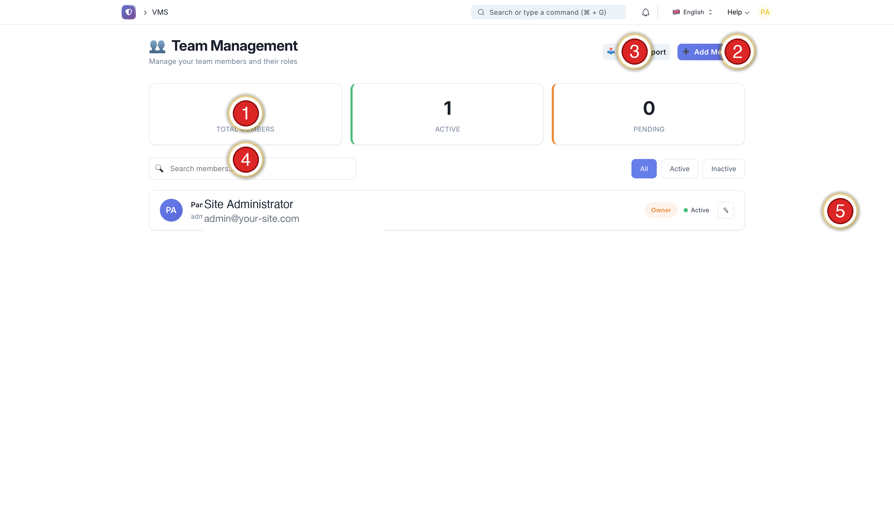{ width=6.0in }

| Step | Do this |
|:---:|---|
| **①** | Member counters (Total / Active / Pending) |
| **②** | **+ Add Member** — invite a colleague |
| **③** | **Batch Import** — many users from CSV |
| **④** | Search a member |
| **⑤** | Pencil — edit or disable |

**The roles (give the least powerful one that does the job):**

| Role | Can do |
|---|---|
| VMS Admin | Everything |
| VMS Site Manager | Create/edit passes, reports |
| VMS Security | Use the scanner |
| VMS Auditor | Read-only auditor scanner |
| VMS Viewer | Dashboards & reports only |

> **Note.** To remove someone, set their status to **Inactive** (you can't delete — the audit trail must stay). "Same access as X" means copying their **role + site access + membership**, not just the role.

\newpage

# 11 · Reports

*Goal: answer "who, when, how long" in seconds.*

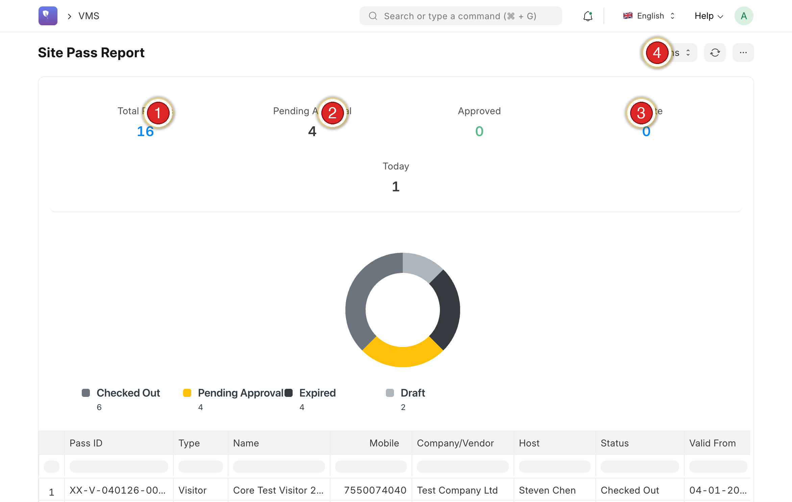{ width=6.0in }

| Step | Element |
|:---:|---|
| **①** | Total Passes |
| **②** | Pending / On Site |
| **③** | On Site |
| **④** | **Actions** — export Excel / PDF, refresh |

> **Tip.** Set a date range, then **Export → Excel** for spreadsheets or **PDF** for management.

\newpage

# 12 · The audit log

*Goal: see who did what, and when.*

| Step | Do this |
|:---:|---|
| **①** | Open **VMS Audit Log** from the dashboard |
| **②** | Filter by date and user |
| **③** | Click any entry for full detail |

> **Note.** Every registration, edit, sign-in and role change is recorded here.

\newpage

# A · Tips

| Tip | Why |
|---|---|
| One login each | Keeps the audit trail clean and secure |
| Least privilege | Not everyone needs Admin |
| Photo is required | No pass is issued without one — tell visitors to allow the camera |
| Use the in-app scanner | Google Lens / phone camera cannot check people in |
| Trust the On-Site count | It self-corrects nightly (Section 8) |
| Push self-registration | No gate queue; the pass issues itself |
| Laminate Section 7 | Keep the scanner card at the gate for guards |
| Push Aadhaar verify | Auto-fills the verified name and **face-matches the selfie to the card** — proves identity, faster than a typed name |

\newpage

# B · Troubleshooting

| Symptom | Fix |
|---|---|
| Visitor didn't get the OTP | Check the number + country code; wait 60 s, Resend. Limit 3 / 10 min. Low signal → try another number, or create the pass manually. |
| "A photo is required" | Working as intended — add a photo (camera or upload). |
| QR won't scan | Raise screen brightness; wipe the lens. "Expired" → register again. Name ≠ person → refuse. |
| Google Lens shows only text | Expected — use the in-app scanner to check in/out. |
| Forgot password | Forgot Password on sign-in. Link valid **20 min**; weak passwords are rejected; if Update does nothing, the link expired — request a new one. |
| User can't sign in | "Invalid" → reset. "Disabled" → reactivate. "Too many attempts" → wait 15 min. |
| New person sees no data | Role copied but site access wasn't — ask IT to mirror an existing admin fully. |
| On-Site looks high mid-day | Normal — self-corrects overnight (Section 8). |
| QR photo won't verify | The Secure QR is dense — retake so the QR is **sharp, well-lit and fills the frame**, or use **Upload** with a clear close-up. |
| "Failed UIDAI verification" | The QR isn't a genuine/intact Aadhaar Secure QR — use the original card, eAadhaar PDF, or mAadhaar. |
| Face check says "no match" | Retake the selfie **facing the camera in good light**; make sure the card-front photo clearly shows the face. A no-match **does not block** the pass — the guard verifies in person. |
| Face check can't find a face | Hold the phone steady, fill the frame with the face, avoid backlight/glare; then retake. |

\newpage

Pansen Engineering India Private Limited · Powered by VMS · Administrator SOP v2.1
