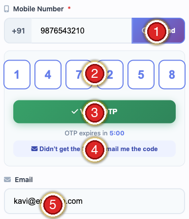
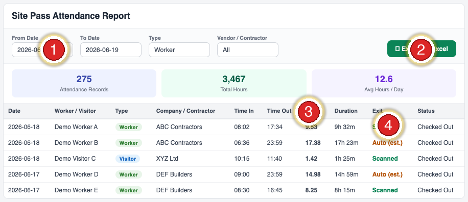
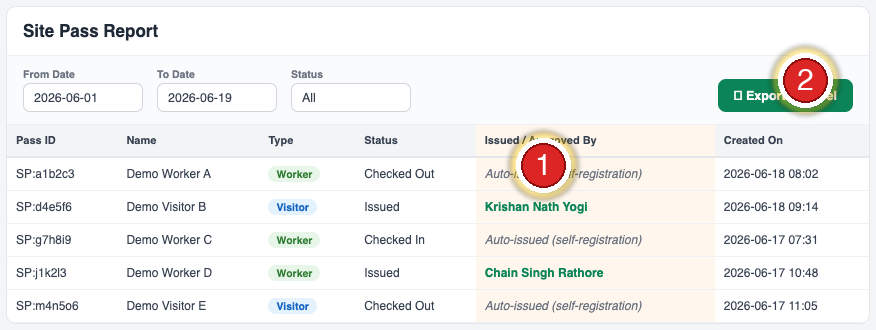

{width=0.7in height=0.7in}

**Pansen Engineering × VMS**

**Responses to Your Meeting Questions — Resolved Items**

A focused, picture-led guide to the points raised in our review call. Each red number on a screenshot matches a numbered step below it.

Version 1.4 · 2026-06-19 · Pansen Engineering India Pvt. Ltd.

| Field | Value |
|---|---|
| **Document** | VMS — Meeting Follow-up (Resolved Items) |
| **Version** | 1.4 |
| **Date** | 2026-06-19 |
| **Prepared for** | Pansen — Masu (HR), Vidhya (IT), Kavi (Site) |
| **Covers** | Aadhaar verification · OTP delivery · exceptions · records & data privacy |
| **Site** | pansen.vmsys.co |

\newpage

# Summary — your points

| # | What you raised | Status |
|:--:|---|---|
| **1** | A pass was issued even when Aadhaar was *not* verified | ✅ **Fixed** — verification is now mandatory |
| **2** | The Aadhaar would not verify on the phone | ✅ **Clarified** — scan the **BACK** QR |
| **3** | The SMS OTP does not arrive at the gate | ✅ **Email OTP added** as a backup |
| **4** | Foreign / Nepal workers have no Aadhaar | ✅ **Admin creates the pass manually** |
| **5** | Download records with verification details | ✅ **Export now shows verification** (ID masked) |
| **6** | Store the Aadhaar card in the system | ⚠️ **Cannot store the full Aadhaar (law)** — see what we keep instead |
| **7** | Can one mobile number be used by many people? | ✅ **Clarified** — one number = one person |
| **8** | Check-in / check-out must be reliable | ✅ **Fixed** — nightly auto check-out enabled |
| **9** | Work-hours attendance (time in / out) report | ✅ **Done** — live now |
| **10** | Who issued / approved each pass | ✅ **Done** — recorded & exportable |
| — | Gate-crowd fast flow · contractor batch sign-up | 🔧 **Next phase** |

> This document covers the items that are **resolved or clarified**. The items marked 🔧 are tracked and will follow with their own steps.

\newpage

# 1 · Aadhaar verification is now mandatory

*Goal: no pass without a verified identity.*

Earlier a pass could be issued even if the Aadhaar was not verified — because the "mandatory" setting was **off**. It is now **ON** for Pansen.

| What it means | Detail |
|---|---|
| Self-registration | A visitor/worker **cannot get a pass** unless their Aadhaar Secure QR is verified |
| A fake / unverified ID | Is **rejected** — no pass |
| Exceptions | Foreigners / no-Aadhaar → **admin creates the pass** (Section 4) |

> **How to confirm it's working:** register on a phone **without** verifying Aadhaar — it should now stop you. With a verified Aadhaar, it issues the pass as normal.

\newpage

# 2 · Scanning the Aadhaar — use the BACK

*Goal: get the QR to read first time.*

{ width=2.7in }

| Step | Do this |
|:---:|---|
| **①** | Tap **Verify with Aadhaar**, then photograph the **BACK** of the card (the big square QR) |
| **②** | It is checked **offline against UIDAI** — the Aadhaar number is never stored |
| **③** | After it verifies, add the visitor's **photo** (Camera / Upload) |

> The **front has no QR** — that is why scanning the front failed in our call. Keep the QR sharp, straight and well-lit. The **mAadhaar app** and **eAadhaar PDF** also work. Kaviyarasu's card was tested and verifies correctly.

\newpage

# 3 · If the SMS OTP doesn't arrive → Email OTP

*Goal: never let a visitor get stuck waiting for an SMS.*

{ width=2.7in }

| Mark | What it is |
|:---:|---|
| **①** | Mobile number + **OTP** — sends the SMS code |
| **②** | Enter the 6-digit code in these boxes |
| **③** | **Verify OTP** |
| **④** | **"Didn't get the SMS? Email me the code"** — the email backup |
| **⑤** | **Email** field — where the emailed code is sent |

> **If the SMS doesn't arrive:** make sure **⑤ Email** is filled, tap **④**, then type the emailed code in **②** and tap **③ Verify**. (Tell the visitor to check the spam folder.)
>
> **For a queue of workers:** pre-register (send the link a day before) or have an admin create passes from the back office. A no-OTP supervisor flow is in the next phase.

\newpage

# 4 · Foreign / no-Aadhaar workers

*Goal: still admit people who can't verify Aadhaar (e.g. Nepal workers).*

Open **Pass Management → + Add Site Pass** on the computer.

{ width=6.0in }

| Step | Do this |
|:---:|---|
| **①** | **Pass Type** — Visitor / Worker |
| **②** | **Full Name** — as printed on the ID |
| **③** | **Mobile** — with country code (+91…) |
| **④** | **Email** — for QR delivery |
| **⑤** | **Save** (top right) — the QR is emailed to them |

> Admin-created passes are **exempt** from the Aadhaar requirement, so genuine foreign workers are never blocked.

\newpage

# 5 · Records & export (with verification)

*Goal: pull a list of who came, when, and whether their ID was verified.*

{ width=6.0in }

| Mark | Element |
|:---:|---|
| **①** | Total Passes |
| **②** | Pending / On Site |
| **③** | On Site |
| **④** | **Actions → Export Excel / PDF** |

The exported report **now also includes** these verification columns:

| New column | Shows |
|---|---|
| **ID Verified** | Yes / No |
| **ID Type** | Aadhaar / PAN / … |
| **ID No. (masked)** | only the **last 4 digits** (e.g. `xxxx-6815`) |
| **Verified On** | date/time of verification |

> **Why the ID is masked.** We show only the last 4 digits on purpose — see Section 6.

\newpage

# 6 · Why we don't store the full Aadhaar (and what we keep)

*Goal: keep your records **and** keep Pansen legally safe.*

We understand you want a record for safety and any police verification. But under India's **DPDP Act 2023** and the **Aadhaar Act**, a company **must not store the full Aadhaar number or a copy of the card** — holding them would put **Pansen** at legal risk.

| Instead, the system keeps (fully compliant) | Why it's enough |
|---|---|
| **Name + photo** | Identifies the person |
| **ID verified ✓ + date** | Proves the identity was checked against UIDAI |
| **Masked Aadhaar (last 4)** | Links to the person without holding the full number |

> **For a police / audit query** this answers *"this verified person worked here on this date"* — without you having to keep documents you're not allowed to hold. You get the record **and** the legal protection.

\newpage

# 7 · One mobile number = one person

*Goal: avoid two people sharing a pass.*

Each mobile number can belong to **one person only** — the same number cannot register two different people. This keeps every pass tied to a single, verified individual.

> For workers who share a phone or have none, the **admin creates their passes** (Section 4). A contractor **batch sign-up** is planned for the next phase.

\newpage

# 8 · Check-in / check-out — now reliable

*Goal: a trustworthy on-site count and smooth re-entry for multi-day workers.*

{ width=4.4in }

| Mark | Element |
|:---:|---|
| **①** | **ON SITE** live count (V = Visitors, W = Workers) — now accurate |
| **②** | **GPS** status (green = located) |
| **③** | **Check In** (green) — scan an arrival |
| **④** | **Check Out** (orange) — scan a departure |
| **⑤** | **Manual Entry** — type a Pass ID if the camera can't read it |

The scanner itself was working fine. The real issue was that the **nightly auto check-out had not been switched on** — so anyone a guard forgot to scan out (**④**) stayed "Checked In" indefinitely. That (a) inflated the **① On-Site count** and (b) blocked multi-day workers the next day ("already checked in").

| What we did | Result |
|---|---|
| Closed all stale "Checked In" passes | **On-site count corrected immediately** |
| Enabled the **nightly auto check-out** | Runs every night from now on — no more build-up |

> **How it works now:** if a guard forgets to scan someone out, the system **auto-checks-out at the end of that day**, so the on-site number stays accurate and the worker can re-enter the next morning.

\newpage

# 9 · Work-hours attendance report

*Goal: see actual time in / time out and hours per worker per day.*

{ width=6.2in }

| Mark | Element |
|:---:|---|
| **①** | **Date range** — pick the period (also filter by Type / Contractor) |
| **②** | **Export to Excel** (or PDF) |
| **③** | **Hours / Duration** — time on site per worker, per day |
| **④** | **Exit** — *Scanned* (real check-out) vs *Auto (est.)* (auto-closed) |

| Column | Shows |
|---|---|
| Date · Worker / Visitor · Type · Company | Who, and which day |
| Time In · Time Out · Hours · Duration | When they were on site |
| **Exit** | **Scanned** = real check-out · **Auto (est.)** = day-end estimate |
| Status | Checked In / Checked Out |

> **Read the Hours carefully.** Where **Exit = "Auto (est.)"** the worker was **not scanned out**, so the hours are an **estimate bounded to end-of-day** (they read high). Hours are accurate only where **Exit = "Scanned"**. For true work-hours, **train guards to scan workers OUT** at the gate.

\newpage

# 10 · Who issued / approved each pass

*Goal: an accountable, exportable record of who issued every pass.*

{ width=6.2in }

| Mark | Element |
|:---:|---|
| **①** | **Issued / Approved By** — who issued each pass |
| **②** | **Export to Excel** (or PDF) |

| The value shows | Meaning |
|---|---|
| **A person's name** (e.g. *Krishan Nath Yogi*) | An admin created / approved that pass in the back office |
| **Auto-issued (self-registration)** | The visitor self-registered and the pass issued automatically (after a verified Aadhaar) — no manual approval |

> **Why "Auto-issued" is correct, not a gap.** Self-service passes issue automatically once Aadhaar is verified — there is no manual step to slow the gate. The record is honest: it **names the admin** when a person issued it, and says **"Auto-issued"** when the system did. Every existing pass was **back-filled**, so the history is complete.

\newpage

# 11 · What's still coming (next phase)

*So you know these are tracked.*

| Item | Plan |
|---|---|
| **Gate-crowd fast flow** | Supervisor issues passes for a line of workers without per-person OTP |
| **Contractor batch sign-up** | Register many workers at once |

> Please drop your full requirement list in the group — we'll reply to each with timing and a short SOP.

---

Pansen Engineering India Private Limited · Powered by VMS · Meeting Follow-up v1.4
